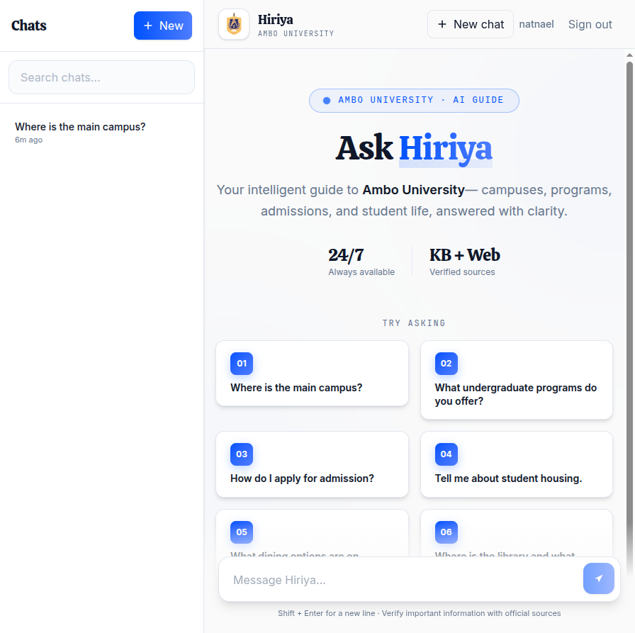
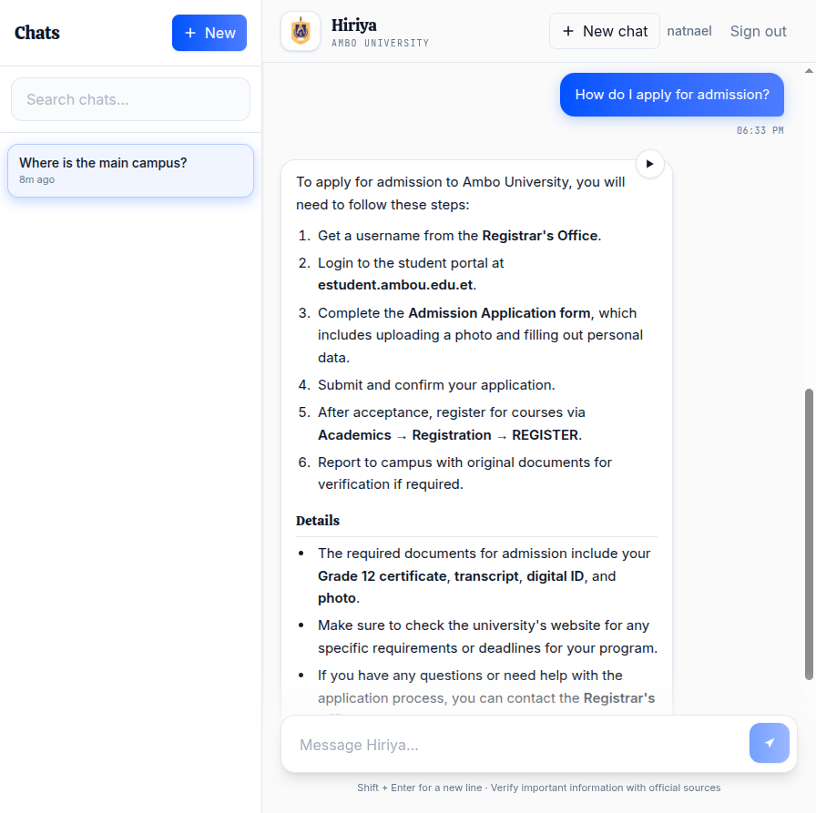
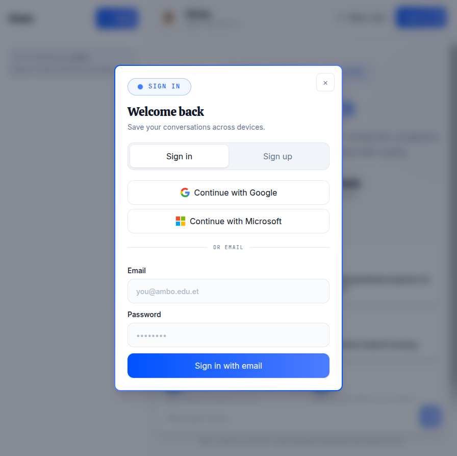
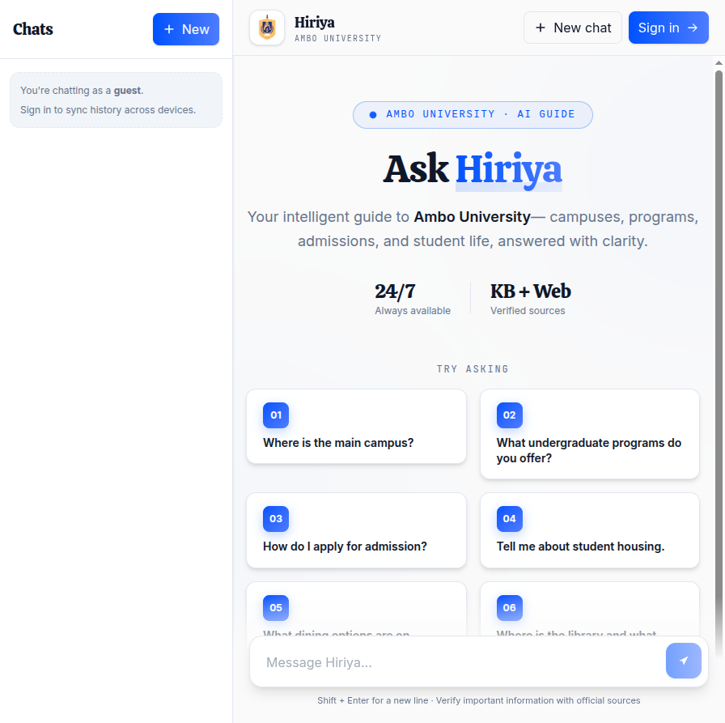

# Hiriya — Ambo University AI Assistant

<p align="center">
  <strong>Your intelligent guide to Ambo University</strong><br />
  Campuses, programs, admissions, and student life — grounded in official knowledge and optional web search.
</p>

---

## Table of contents

1. [Overview](#overview)
2. [Screenshots](#screenshots)
3. [Features](#features)
4. [Tech stack](#tech-stack)
5. [Architecture](#architecture)
6. [Project structure](#project-structure)
7. [Getting started](#getting-started)
8. [Environment variables](#environment-variables)
9. [Knowledge base & ingestion](#knowledge-base--ingestion)
10. [Scripts](#scripts)
11. [Deployment](#deployment)
12. [Verify & test](#verify--test)
13. [Further reading](#further-reading)
14. [License](#license)

---

## Overview

**Hiriya** is a production-style RAG chatbot built for **Ambo University**, Ethiopia. Students and visitors can ask natural-language questions about campuses, programs, housing, dining, admissions, and more. Answers are composed by a large language model and grounded in your ingested documents, with citations and optional DuckDuckGo web results.

The app supports **guest mode** (instant use, no account) and **signed-in mode** (persistent chat history via Clerk + Postgres).

| Mode        | Chat history | Auth        |
| ----------- | ------------ | ----------- |
| Guest       | Session only | None        |
| Signed in   | Saved in DB  | Clerk (email, Google, Microsoft) |

---

## Screenshots

All captures below are from the live UI (desktop unless noted).

### Welcome screen (signed in)

Home view with hero, suggested prompts, and chat sidebar.



### Welcome screen (guest)

Same layout; sidebar prompts sign-in to sync history.


### Active chat

Streaming answers with structured sections (Details, What To Do Next), knowledge-base map links, and web references.




### Sign in / sign up

Custom auth modal with Google, Microsoft, and email flows (Clerk).



### Mobile layout

Responsive welcome and prompt grid on a narrow viewport.



---

## Features

### Retrieval & answers

- **Real RAG** — Documents chunked, embedded with Gemini `gemini-embedding-001`, stored in **Supabase pgvector**.
- **Hybrid retrieval** — Vector search + Postgres full-text + Reciprocal Rank Fusion.
- **LLM reranker** — Groq re-scores candidates before the top chunks reach the answer model.
- **Query rewriting** — Follow-ups like *“and the second one?”* become standalone queries.
- **Web search** — DuckDuckGo (no API key) with an LLM query planner for vague questions.
- **Strict grounding** — Citations by chunk id; phantom citations stripped server-side.
- **Locations** — Map links only from `backend/data/locations.json`.

### Product & UX

- **SSE streaming** with cancel/stop generation.
- **Minimalist Modern UI** — Calistoga + Inter typography, electric-blue gradient accent, Framer Motion on welcome.
- **Sidebar** — Search, new chat, delete, relative timestamps (signed-in users).
- **TTS** — Play assistant replies (ElevenLabs, proxied on the server).
- **Guest + Clerk auth** — No key required locally; graceful degradation.

---

## Tech stack

| Layer      | Technology |
| ---------- | ---------- |
| Frontend   | Vite 7, React 19, Tailwind CSS 4, Framer Motion |
| Backend    | Express 4 (ESM), Node 20+ |
| Auth       | Clerk (`@clerk/clerk-react`, `@clerk/express`) |
| Database   | Supabase Postgres + pgvector |
| Embeddings | Google Gemini `gemini-embedding-001` |
| LLM        | Groq `llama-3.3-70b-versatile` |
| Web search | DuckDuckGo (+ optional query planner) |
| TTS        | ElevenLabs (server proxy) |
| Deploy     | Vercel (frontend), Fly.io (backend) |

---

## Architecture

```
┌─────────────────────────────────────────────────────────────┐
│  Browser (Vite + React)                                      │
│  • Clerk JWT or anonymous guest                              │
│  • SSE chat streaming · TTS playback                         │
└───────────────────────────┬─────────────────────────────────┘
                            │  /api/*
┌───────────────────────────▼─────────────────────────────────┐
│  Express API (Fly.io)                                        │
│  /api/health · /api/chat (SSE) · /api/chats · /api/rag · TTS │
└───┬─────────────┬──────────────┬──────────────┬─────────────┘
    │             │              │              │
    ▼             ▼              ▼              ▼
 Gemini       Groq LLM      DuckDuckGo    ElevenLabs
 embed        + rerank      web search         TTS
    │
    ▼
 Supabase (pgvector + chats/messages)
```

Deep dive: [`ARCHITECTURE.md`](ARCHITECTURE.md).

---

## Project structure

```
hiriya_ChatBot/
├── frontend/                 # React app (Vercel)
│   ├── src/
│   │   ├── App.jsx
│   │   ├── components/       # UI, chat, AuthModal, WelcomeScreen, …
│   │   ├── components/ui/    # Button, Card, Input, SectionLabel
│   │   ├── hooks/            # useChat, useChats, useAuthToken
│   │   └── services/         # apiClient, ttsService
│   └── tests/                # Vitest + Testing Library
├── backend/                  # Express API (Fly.io)
│   ├── src/routes/           # chat, chats, rag, health, tts
│   ├── src/rag/              # retriever, reranker, chunker, embedder
│   ├── src/search/           # DuckDuckGo + query planner
│   ├── data/                 # knowledge.json, locations.json, …
│   └── scripts/              # ingest, migrate, reset
├── docs/screenshots/         # README visuals
├── scripts/dev.mjs           # frontend + backend together
└── .github/workflows/ci.yml
```

---

## Getting started

**Prerequisites:** Node.js **20+**, npm, a Supabase project, and API keys (see below).

```bash
# 1. Clone and install (monorepo workspaces)
cd hiriya_ChatBot
npm install

# 2. Environment files
cp frontend/.env.example frontend/.env.local
cp backend/.env.example backend/.env
# Fill in Supabase, Gemini, Groq, and optionally Clerk / ElevenLabs / web search flags

# 3. Database migrations (prints SQL for Supabase SQL editor)
npm run --workspace backend migrate

# 4. Add documents under backend/data/ then ingest
npm run ingest

# 5. Run frontend + backend
npm run dev:all
```

| Service   | URL |
| --------- | --- |
| Frontend  | http://localhost:5173 |
| Backend   | http://localhost:3001 |

**Clerk (optional locally):** Set `VITE_CLERK_PUBLISHABLE_KEY` and `CLERK_SECRET_KEY`. Enable Google/Microsoft under Clerk → Social connections and add `http://localhost:5173` to redirect URLs.

---

## Environment variables

### Frontend (`frontend/.env.local`)

| Variable | Description |
| -------- | ----------- |
| `VITE_API_URL` | Backend base URL (e.g. `http://localhost:3001`) |
| `VITE_CLERK_PUBLISHABLE_KEY` | Clerk publishable key (omit for guest-only) |

### Backend (`backend/.env`)

| Variable | Description |
| -------- | ----------- |
| `SUPABASE_URL` | Supabase project URL |
| `SUPABASE_SERVICE_ROLE_KEY` | **Secret** service role key (not anon/publishable) |
| `GEMINI_API_KEY` | Embeddings |
| `GROQ_API_KEY` | Chat + reranker |
| `CLERK_SECRET_KEY` | JWT verification |
| `ELEVENLABS_API_KEY` | TTS (optional) |
| `WEB_SEARCH_ENABLED` | `true` to blend DuckDuckGo results |
| `CORS_ORIGINS` | e.g. `http://localhost:5173` |

Full list: [`backend/.env.example`](backend/.env.example).

---

## Knowledge base & ingestion

1. Place content in `backend/data/` — **PDF, MD, HTML, TXT, JSON** (plus `knowledge.json` / `locations.json` for structured FAQ and maps).
2. Run:

```bash
npm run ingest
```

3. Use `npm run rag:reset` only when you need to wipe and re-ingest.

See [`backend/data/README.md`](backend/data/README.md) for file conventions.

---

## Scripts

| Command | Description |
| ------- | ----------- |
| `npm run dev:all` | Frontend + backend with prefixed logs |
| `npm run dev:frontend` | Vite only |
| `npm run dev:backend` | API only |
| `npm run build:frontend` | Production frontend build |
| `npm run ingest` | Embed and load `backend/data/` |
| `npm run test` | Frontend + backend tests |
| `npm run lint` | ESLint both workspaces |

---

## Deployment

| Component | Provider | Notes |
| --------- | -------- | ----- |
| Frontend | Vercel | `frontend/vercel.json`, set `VITE_*` env |
| Backend | Fly.io | `backend/Dockerfile`, `fly.toml` |
| Database | Supabase | pgvector extension required |
| Auth | Clerk | Production URLs in allowed origins |

```bash
# Smoke test (local or production API)
./scripts/smoke.sh http://localhost:3001
./scripts/smoke.sh https://your-api.fly.dev
```

---

## Verify & test

```bash
npm run test
npm run lint
npm run build:frontend
```

Frontend tests live in `frontend/tests/` (WelcomeScreen, Sources, ErrorBanner).

---

## Further reading

- [`ARCHITECTURE.md`](ARCHITECTURE.md) — RAG pipeline, auth model, SSE flow
- [`backend/README.md`](backend/README.md) — API routes and scripts
- [`frontend/README.md`](frontend/README.md) — Frontend dev notes

---

## License

[MIT](LICENSE)
